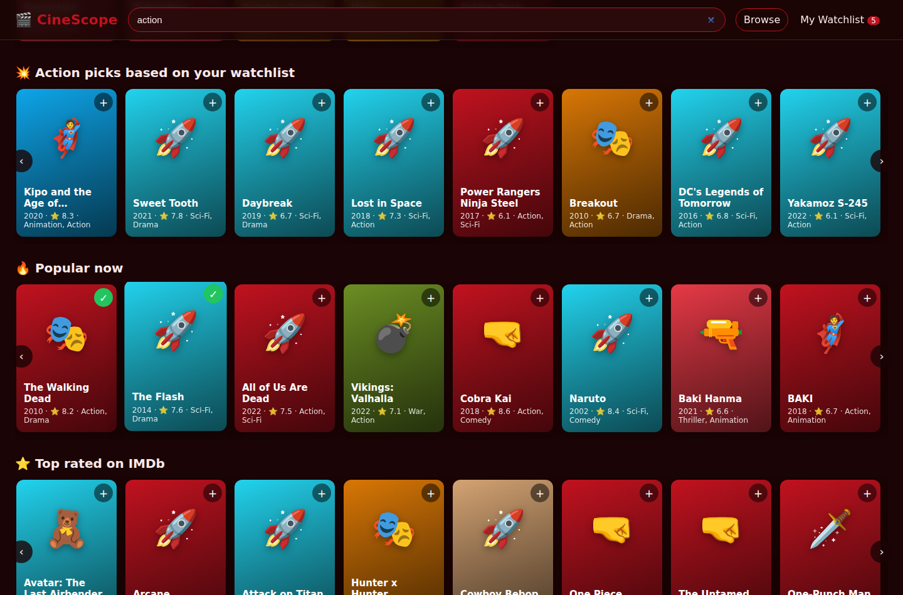
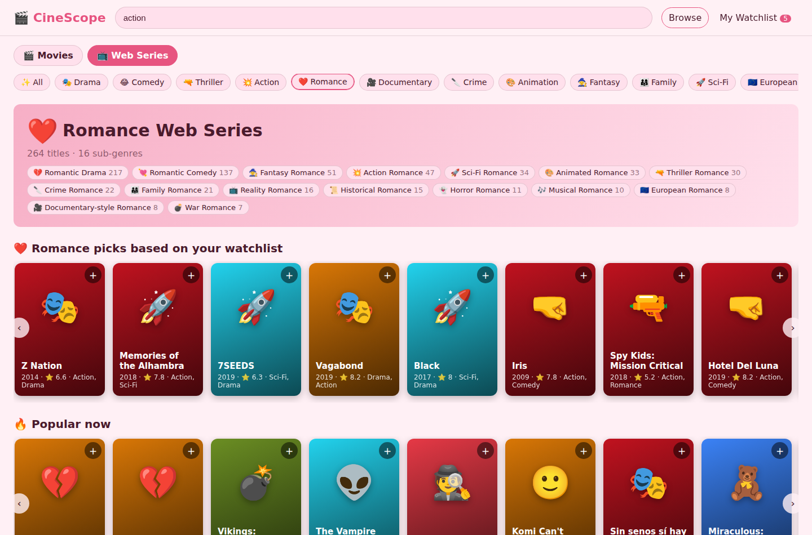
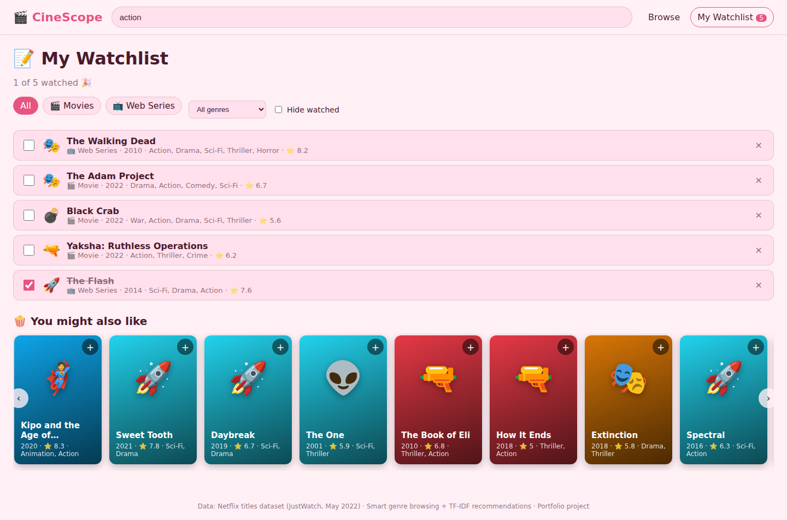

# 🎬 CineScope: Movies & Web Series by Genre

A genre-first way to find something to watch. Pick **Action** and the whole site turns blood red, splits into sub-genres like **🔪 Crime Action** and **🔫 Action Thriller**, and shows popular, top-rated and Indian picks in separate rows. Pick **Romance** and it turns pink. Add titles to a watchlist, tick them off when you finish, and get recommendations based on what you saved.



## Features

- **Main genre → sub-genres.** 19 genres. Each genre page is split into sub-genres built from the genres that appear together (Action → Drama Action, Action Thriller, Crime Action, Action Comedy, Sci-Fi Action, War Action…), each with its own row and title count.
- **Emoji per genre and sub-genre.** 💥 action, 🔫 action thriller, 🔪 crime action, 💣 war, ❤️ romance, 💘 romantic comedy, 💔 romantic drama, 👻 horror, 😂 comedy, 🚀 sci-fi… Cards pick the most specific emoji for their genre mix.
- **Theme changes with the genre.** Blood red for action, pink for romance, light blue for family, deep purple for horror, neon blue for sci-fi. Typing "action" or "romantic" in search switches the theme too.
- **Movies and web series kept apart**, each with rows for 🔥 Popular now, ⭐ Top rated on IMDb, 🇮🇳 From India and 🆕 Recently released.
- **Watchlist** saved in the browser (no login). Filter by movies / web series / genre, tick ✅ when watched (it moves down and gets struck through), see "3 of 10 watched".
- **Recommendations.** "More like this" on every title, "Because of your watchlist" on the home page, and "Romance picks based on your watchlist" when you're inside a genre.
- **Search** that ignores accents: "bahubali" finds *Bāhubali*.
- **Live TMDB mode (optional):** with a free TMDB API key the site loads current movies and web series with **real posters** and a **language filter** (Telugu, Hindi, Tamil, Malayalam, Kannada, English…). Without a key it falls back to the bundled dataset, so it always works.
- Works on phones.

| | |
|---|---|
|  |  |

## How the recommender works

Each title becomes a vector:

- **Story words:** TF-IDF of the description (single words and two-word phrases, English stop words removed)
- **Genres:** one-hot genre list

The two parts are weighted and joined, and titles are compared with cosine similarity. For the watchlist, the saved titles are averaged into one "taste" vector. Titles with no description are never suggested, because their vector is only genres and they'd show up everywhere.

### Is it any good? A franchise test

A recommender that understands the story should find other parts of the same franchise (Bāhubali 1 → Bāhubali 2, Blade → Blade II, Godzilla films) **without ever seeing the titles**, only descriptions and genres. The test uses 214 franchise groups (515 titles) found automatically from title prefixes and checks whether another part appears in the top 10:

| Method | Other part in top 10 |
|---|---|
| Random title | 0.8% |
| Most popular in the same genre | 1.7% |
| Story words only | 72.6% |
| **Story + genre (weight 0.3, used)** | **76.1%** |
| Story + genre (weight 0.6) | 54.0% |
| Story + genre (weight 0.8) | 52.2% |

Adding a little genre information helps; too much drowns out the story. The 0.3 weight was chosen on this same test, so treat 76% as slightly optimistic. Run it with `python scripts/eval_recommender.py`.

## Tech

- **Backend:** Python, FastAPI, pandas, scikit-learn (TF-IDF, cosine similarity)
- **Frontend:** plain HTML, CSS and JavaScript (no framework). Themes are four CSS variables that animate when they change.
- **Tests:** 12 pytest tests (sub-genres, movie/series separation, accent-free search, sequel found by "More like this", genre-scoped recommendations, input validation, and TMDB mode with faked API responses: genre/language mapping, posters, language filter)

### API

| Endpoint | What it returns |
|---|---|
| `GET /api/meta` | Data source (TMDB or dataset), available languages, attribution |
| `GET /api/genres` | Genres with emoji, colour theme and title count |
| `GET /api/browse?kind=movie&genre=action&lang=te` | Popular / top-rated / India / recent rows + sub-genre rows |
| `GET /api/search?q=romantic` | Matching titles + detected genre |
| `GET /api/title/{id}` | Title details + "More like this" |
| `POST /api/recommend` | `{ids, kind?, genre?}` → recommendations for a watchlist |

Interactive docs at `/docs` when the server is running.

## Run it

```bash
pip install -r requirements.txt

# optional: latest titles + posters from TMDB (free key from themoviedb.org/settings/api)
#   Windows:  set TMDB_API_KEY=your_key
#   Mac/Linux: export TMDB_API_KEY=your_key
python scripts/fetch_tmdb.py

uvicorn app.main:app --reload
# open http://localhost:8000

pip install -r requirements-dev.txt
pytest -q
```

Deploy: connect the repo on [Render](https://render.com) (free web service). `render.yaml` has the build and start commands; add `TMDB_API_KEY` in Render's environment settings for live data. The key is never stored in the repo, and the downloaded TMDB catalog is git-ignored.

## Data

**Live mode:** [TMDB](https://www.themoviedb.org) Discover API, about 80 popular titles per genre plus the most popular Telugu, Hindi, Tamil, Malayalam and Kannada titles, downloaded at build time (`app/tmdb.py`). *This product uses the TMDB API but is not endorsed or certified by TMDB.*

**Fallback:** [Netflix TV Shows and Movies](https://www.kaggle.com/datasets/victorsoeiro/netflix-tv-shows-and-movies) (JustWatch, May 2022): 5,806 titles, of which 5,738 have genres (3,723 movies, 2,015 web series). Titles after May 2022 aren't included. Posters aren't in the dataset, so cards use genre colours and emoji instead.

## Next steps

- Cast and director in the recommender (TMDB credits)
- Where-to-watch links (TMDB watch providers)
- Optional login so the watchlist follows you across devices
